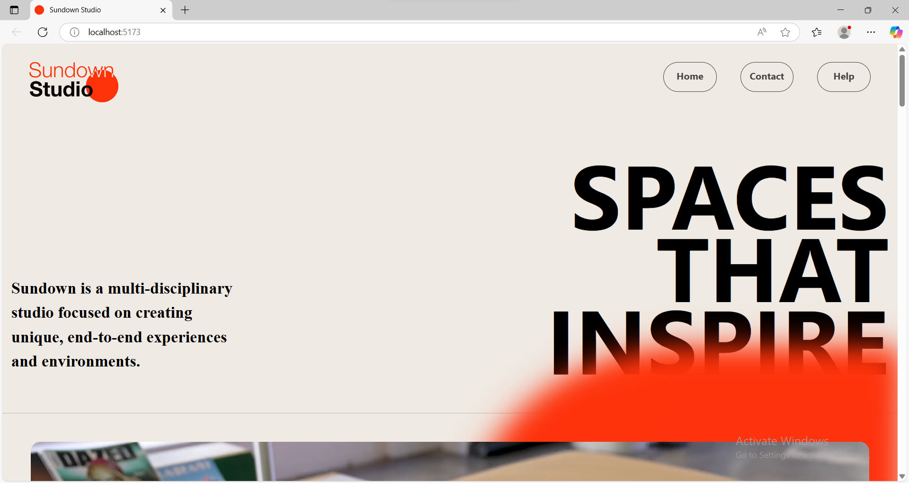
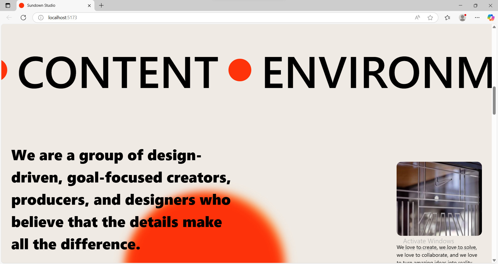
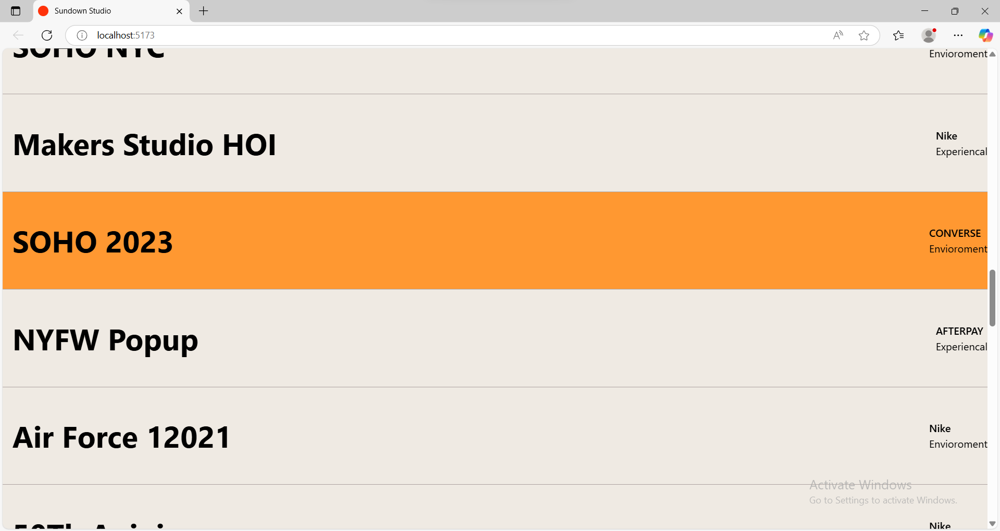
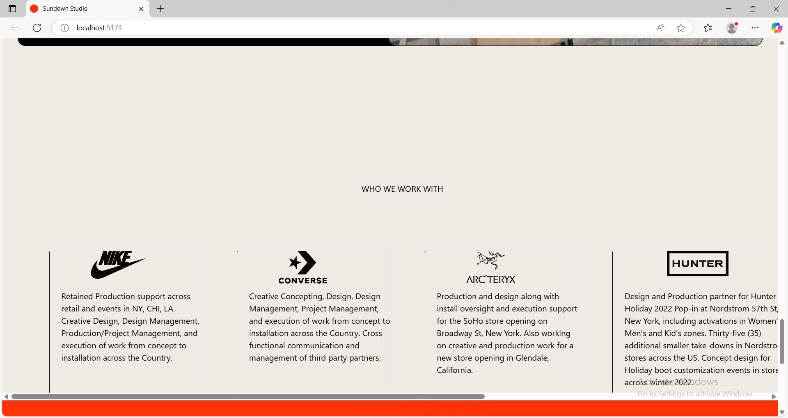
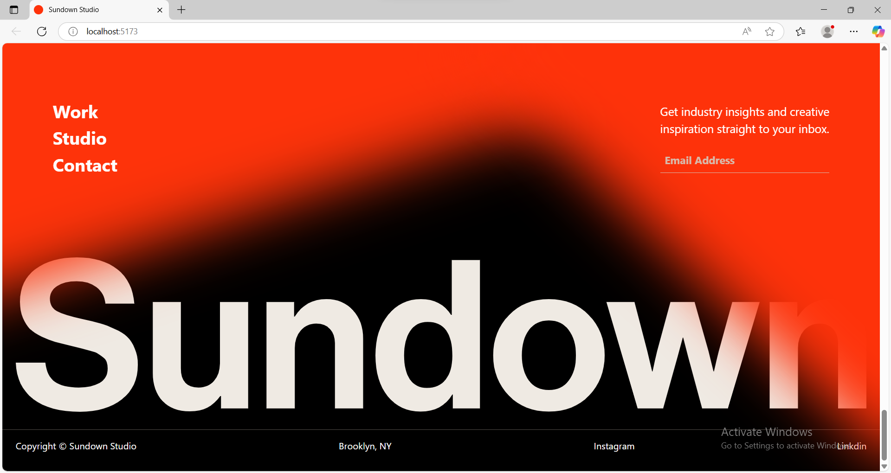

# Sundown Studio Clone 🌇

This is a front-end clone of the **Sundown Studio** website, built using **React**, **Tailwind CSS**, and **Vite**. It features custom animations and smooth UI transitions.

## 🚀 Features

- Responsive layout
- Smooth animations using Framer Motion
- Styled with Tailwind CSS
- Clean, modern design

## 🔧 Tech Stack

- React
- Tailwind CSS
- Vite
- Framer Motion

## 📸 Preview
# Project Screenshots

## Screenshot 1


## Screenshot 2


## Screenshot 3


## Screenshot 4


## Screenshot 5



## 📂 Installation

```bash
git clone https://github.com/Aarru-jadhav/Sundown-studio-clone.git
cd Sundown-studio-clone
npm install
npm run dev
